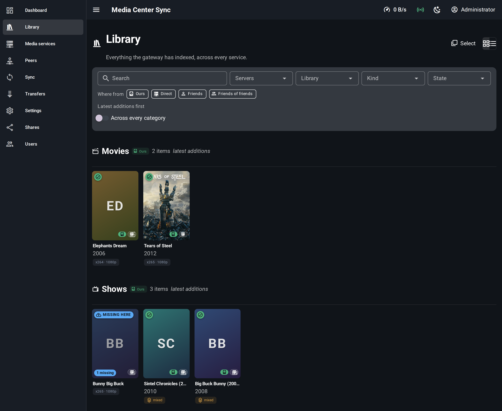
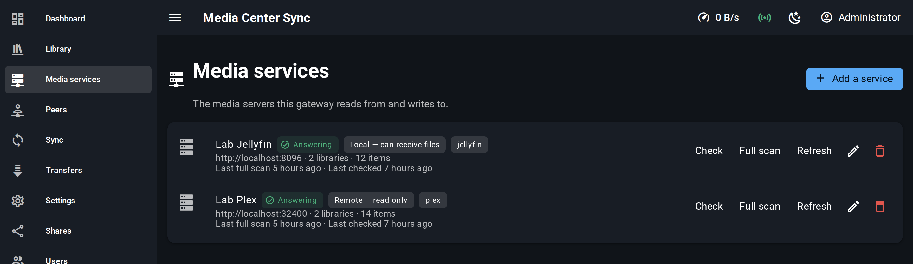

# Media Center Sync

[](https://github.com/Smeagolworms4/media-center-sync/actions/workflows/build.yml)
[](https://github.com/Smeagolworms4/media-center-sync/pkgs/container/media-center-sync)
[](LICENSE)

Une passerelle qui se place à côté de vos serveurs multimédias et les maintient
synchronisés entre eux — et avec ceux de vos amis.

Vous enregistrez des services multimédias : le Jellyfin du salon, le Plex du NAS, la
passerelle d'un ami à l'autre bout de la ville. Media Center Sync les indexe tous,
détermine quels éléments correspondent au même contenu, vous montre en un coup d'œil
ce qu'il vous manque, et le rapatrie — de façon reprenable, depuis plusieurs sources à
la fois, directement dans le dossier de bibliothèque que votre propre serveur
surveille déjà.

*[English version](README.md)*


Les bibliothèques de même nom deviennent une seule catégorie, quel que soit le nombre
de serveurs où elles vivent, et chaque affiche porte l'essentiel : si vous l'avez, où
sont les copies, et `x265 · 1080p` — ou `mixed`, quand les sources ne s'accordent pas.



Un service dont la passerelle atteint les dossiers est un endroit où des fichiers
peuvent atterrir. Un service où l'on a seulement un compte est un endroit où lire et
puiser. La différence est affichée sur la ligne, parce qu'elle décide de ce qu'une
synchronisation peut faire.

---

## Installation

Un conteneur, un volume, aucun serveur de base de données à gérer.

```yaml
# compose.yaml
services:
  media-center-sync:
    image: ghcr.io/smeagolworms4/media-center-sync:main
    restart: unless-stopped
    ports:
      - 4200:4200   # the interface, the API and peer links — one port, same origin
    environment:
      # Change this. It signs the sessions, and production refuses to start without it.
      MCS_JWT_SECRET: change-me
    volumes:
      # The index, the SQLite file and the transfer scratch space.
      - mcs-data:/data
      # Your libraries. See the warning below — this is the one thing to get right.
      - /mnt/nas:/media

volumes:
  mcs-data:
```

```bash
docker compose up -d
```

Ouvrez **http://localhost:4200** et connectez-vous avec **`admin` / `admin`**. Changez
ce mot de passe, enregistrez votre premier service multimédia, et la passerelle
commence à indexer.

> **Le montage `/media` est la seule chose qui doit absolument être juste.**
>
> Il doit pointer vers les mêmes fichiers que ceux vus par votre serveur multimédia. Si
> votre Jellyfin a `/media/Shows` et que la passerelle écrit dans un répertoire
> différent qui porte par hasard le même nom, chaque transfert réussira, les fichiers
> seront bel et bien là, et votre bibliothèque restera vide — sans qu'aucune erreur ne
> soit signalée nulle part. L'interface le détecte et vous le signale, mais autant bien
> faire les choses avant la première synchronisation.

**Il n'y a qu'un seul port.** Une liaison entre pairs est une mise à niveau WebSocket
sur le port qui sert déjà l'interface : un reverse proxy et son certificat TLS
couvrent donc le trafic entre pairs sans rien de plus, et il n'y a rien à rediriger
sur le routeur au-delà de ce que vous avez ouvert pour joindre l'interface.

Si aucune des deux extrémités n'est joignable depuis l'extérieur, les liaisons
retombent sur un relais via le rendez-vous : ça fonctionne, mais la bande passante du
relais est partagée entre tous ceux qui l'utilisent. Voir
[ce qu'un seul port ne résout pas](#ce-quun-seul-port-ne-résout-pas).

### Environnement

| Variable | Valeur par défaut | Ce qu'elle fait |
|---|---|---|
| `MCS_JWT_SECRET` | *(aucune)* | Signe les sessions. **Obligatoire en production** — il n'y a délibérément pas de valeur par défaut. |
| `MCS_MEDIA_ROOT` | `/media` | Où sont montés vos dossiers de bibliothèque, tels que la passerelle les voit. |
| `API_PORT` | `4200` | Interface, API et liaisons entre pairs. Il n'y a pas de second port. |
| `DB_TYPE` | `sqlite` | `sqlite` ou `postgres`. |
| `DB_FILE` | `/data/media-center-sync.db` | Fichier SQLite. |
| `DB_HOST` `DB_PORT` `DB_NAME` `DB_USER` `DB_PASSWORD` | — | Lues uniquement quand `DB_TYPE=postgres`. |
| `REDIS_HOST` `REDIS_PORT` | *(vide)* | Vide signifie un cache en mémoire du processus. Utile seulement avec plusieurs passerelles. |
| `MCS_TRANSFER_ROOT` | `/data/transfer` | Où les pièces s'accumulent avant qu'un fichier ne soit placé. |
| `MCS_CORS_ORIGINS` | *(vide)* | Séparées par des virgules. Inutile quand l'interface est servie par l'API. |
| `MCS_ADMIN_USER` `MCS_ADMIN_PASSWORD` | `admin` / `admin` | Le premier compte, créé au premier démarrage. |

SQLite et un cache en mémoire du processus sont les valeurs par défaut à dessein :
c'est une passerelle qu'on auto-héberge à côté de son serveur multimédia, pas un
service multi-tenant. Ni un PostgreSQL ni un Redis ne devraient avoir besoin d'être
maintenus en vie pour rapatrier quelques épisodes. Les deux restent à une variable
d'environnement de distance, et les migrations sont les mêmes dans un cas comme dans
l'autre.

### Derrière un reverse proxy

L'API sert l'interface, `/api` et le point d'entrée des pairs sur la même origine, il
n'y a donc rien à séparer. Deux choses doivent survivre au passage : la **mise à
niveau WebSocket**, sur `/api/events` — sans laquelle chaque barre de progression
reste à zéro alors que les fichiers arrivent parfaitement bien — et sur
`/api/peer/link`, là où les autres passerelles se connectent ; et un **délai de
lecture généreux**, parce qu'un transfert peut durer des heures.

La configuration ci-dessous couvre les deux, puisqu'elle transmet la mise à niveau
pour tous les chemins. C'est aussi toute l'histoire du TLS entre pairs : le certificat
que vous avez déjà pour l'interface est celui que la passerelle d'un ami valide.

```nginx
location / {
    proxy_pass http://127.0.0.1:4200;
    proxy_http_version 1.1;
    proxy_set_header Upgrade $http_upgrade;
    proxy_set_header Connection "upgrade";
    proxy_set_header Host $host;
    proxy_read_timeout 3600s;
}
```

---

## Table des matières

- [Installation](#installation)
- [Ce qu'il fait](#ce-quil-fait)
- [Fonctionnement](#fonctionnement)
  - [Services, locaux et distants](#services-locaux-et-distants)
  - [Indexation, et pourquoi la passerelle met en cache](#indexation-et-pourquoi-la-passerelle-met-en-cache)
  - [Corrélation : qu'est-ce que le même contenu](#correlation-quest-ce-que-le-meme-contenu)
  - [La qualité en un coup d'œil](#la-qualite-en-un-coup-doeil)
  - [Synchronisation](#synchronisation)
  - [Transferts](#transferts)
  - [Quand un transfert tourne mal](#quand-un-transfert-tourne-mal)
  - [Pairs, amis, et amis d'amis](#pairs-amis-et-amis-damis)
  - [Ce qu'un seul port ne résout pas](#ce-quun-seul-port-ne-résout-pas)
  - [Partage](#partage)
  - [Connexion](#connexion)
- [Développement](#developpement)
- [Tests](#tests)
- [Organisation du projet](#organisation-du-projet)
- [Intégration continue](#integration-continue)
- [Licence](#licence)

---

## Ce qu'il fait

- **Enregistre un nombre quelconque de services multimédias**, locaux ou distants, via
  un gestionnaire par type de service. Jellyfin et Plex sont pris en charge d'office ;
  en ajouter un autre revient à écrire une classe.
- **Corrèle les médias entre tous les services**, si bien que la page d'une saison peut
  vous dire que vous avez les épisodes 1 à 6, que les épisodes 7 et 8 existent sur le
  serveur d'un ami, et que votre copie de l'épisode 3 est en 720p alors qu'une version
  1080p existe ailleurs.
- **Affiche l'état de chaque élément** avec une seule icône et un seul vocabulaire,
  partout : synchronisé, manquant, obsolète, en conflit, en cours de synchronisation,
  local uniquement, inconnu.
- **Résume la qualité** par série ou par saison — `x265 · 1080p`, ou `mixte` avec
  chaque variante listée dans l'infobulle, parce qu'une bibliothèque est rarement
  uniforme et qu'un codec unique choisi arbitrairement donnerait un résumé mensonger.
- **Lance des synchronisations**, ponctuelles ou planifiées, qui rapatrient ce qui
  manque dans le bon dossier, avec le bon nom, les métadonnées et les jaquettes.
- **Transfère correctement** : découpé en morceaux, reprenable, plusieurs connexions
  par source, plusieurs sources par fichier, pause et reprise, progression en direct,
  vérification par morceau et réparation ciblée.
- **Relie les passerelles de pair à pair**, directement quand le réseau le permet et
  via un relais de rendez-vous quand ce n'est pas le cas, avec une découverte d'amis
  d'amis permettant à plusieurs personnes détenant le même fichier d'alimenter un même
  transfert.
- **Vous laisse décider ce que vous partagez**, par bibliothèque, avec qui, et si les
  destinataires reçoivent les fichiers ou seulement le catalogue.

## Fonctionnement

### Services, locaux et distants

Il n'y a pas de « mon serveur » privilégié. Une passerelle détient une liste de
services multimédias :

- un service **local** est un service dont la passerelle peut écrire dans les dossiers
  de bibliothèque — ses fichiers atterrissent sur un disque que la passerelle a
  monté ;
- un service **distant** est un service dont elle ne peut que lire le contenu — celui
  d'un ami, atteint via une liaison entre pairs, ou l'un des vôtres dans lequel vous
  préférez ne pas écrire.

Vous pouvez en enregistrer plusieurs de chaque. Une synchronisation se déclenche
*entre* deux d'entre eux, ce qui explique que rien dans le modèle ne désigne lequel
est « la » cible.

Chaque type est un gestionnaire. L'application ne sait jamais si elle parle à Jellyfin
ou à Plex : elle demande à un gestionnaire de sonder, de lister les bibliothèques, de
scanner, de rafraîchir, d'ouvrir une plage d'octets. Ajouter Emby, Kodi ou un simple
index HTTP revient à écrire cette seule classe.

### Indexation, et pourquoi la passerelle met en cache

**L'interface n'interroge jamais vos serveurs multimédias.** Elle lit l'index propre à
la passerelle. C'est ce qui rend une bibliothèque de quarante mille épisodes
navigable, et c'est ce qui évite que dix onglets de navigateur ouverts ne se
transforment en dix requêtes vers un Raspberry Pi.

L'index est maintenu à jour de deux façons :

- un **rafraîchissement**, léger et fréquent, demande à chaque service sa propre liste
  courte d'ajouts récents et fait avancer un curseur par bibliothèque. Quelques
  dizaines de lignes, toutes les quelques minutes ;
- un **scan complet**, rare et planifié — plus un bouton dans l'interface — relit
  tout. Il doit exister, parce qu'un rafraîchissement ne voit que ce qu'un service
  *signale* comme nouveau : des fichiers déplacés, supprimés ou réencodés sur place
  passeraient sinon inaperçus.

### Corrélation : qu'est-ce que le même contenu

Deux bibliothèques appellent le même épisode `S01E02`, `1x02`, `102` ou
`Show.S01E02.1080p.WEB-DL.x265-GROUP`. Décider qu'il s'agit de la même chose est la
partie qui doit être juste, donc c'est fait dans l'ordre de fiabilité de chaque
signal :

1. **checksum** — certain, et presque jamais disponible d'emblée ;
2. **identifiant externe** — l'identifiant TVDB, TMDB ou IMDb sur lequel les deux
   services s'accordent déjà ;
3. **saison et épisode**, sous un parent déjà corrélé ;
4. **titre normalisé** et année, notés par similarité ;
5. **chemin**.

Chaque correspondance est stockée dans sa propre ligne avec la stratégie utilisée et
un score de confiance entre 0 et 1, de sorte qu'une corrélation erronée puisse être
expliquée et annulée plutôt que de rester un fait inexpliqué. En dessous du seuil
configuré, une correspondance est *proposée*, pas appliquée.

Les éléments ne sont jamais fusionnés. Le même épisode détenu par trois amis
représente trois lignes dans l'index — les fusionner obligerait à choisir quel titre,
quelle jaquette et quelle taille de fichier conserver, et à perdre exactement les
différences qu'une synchronisation existe pour montrer.

### La qualité en un coup d'œil

La ligne d'une saison affiche une seule pastille : `x265 · 1080p`. Quand ses épisodes
divergent, elle affiche `mixte`, et l'infobulle liste chaque variante avec le nombre de
fichiers qui la portent et l'espace qu'ils occupent. C'est le seul résumé honnête
possible — et au moment où vous avez besoin de savoir quel épisode fait exception, il
est juste là.

La même comparaison décide si une copie distante est *meilleure* que la vôtre : la
résolution d'abord, puis l'efficacité du codec, puis le débit, et seulement ensuite la
taille. La taille seule est un mauvais signal — un rip 720p mal compressé est plus gros
qu'un bon encodage 1080p.

### Synchronisation

Un **plan de synchronisation** est une intention permanente : quoi rapatrier, depuis
où, vers où. Les sources forment une liste ordonnée ; laissée vide, elle suit la
priorité de service définie une bonne fois dans l'écran d'administration, ce que la
plupart des gens souhaitent — figer la liste dans chaque plan obligerait à tous les
modifier le jour où le serveur d'un ami change d'adresse.

La destination suit le même principe. Par défaut, un fichier rapatrié va **à côté de
votre propre copie** de cette série ou de cette collection, ce qui laisse une
bibliothèque déjà bien rangée le rester, et fait ce qu'il faut pour les collections.
Vous pouvez à la place tout envoyer vers une bibliothèque choisie, ou vers un chemin
fixe.

Les plans s'exécutent manuellement, sur une planification cron, ou dès qu'une source
annonce une nouveauté. Chaque plan peut être prévisualisé avant de s'exécuter : ce
qu'il rapatrierait, depuis où, vers quel chemin, et combien d'octets cela représente.

### Transferts

Un transfert est découpé en morceaux. Chaque pièce enregistre quelle source l'a
servie, combien de tentatives cela a demandé, et l'empreinte qu'elle est censée avoir.
Cet état vit dans la base de données, pas en mémoire — une passerelle redémarrée en
plein rapatriement doit savoir quelles pièces elle détient déjà, sous peine de
repartir de zéro sur une saison de quarante gigaoctets.

De là découlent, sans qu'aucun ne soit un cas particulier :

- **plusieurs connexions vers une même source**, quand elle honore les requêtes par
  plage ;
- **plusieurs sources pour un même fichier**, choisies selon le débit mesuré ;
- **pause et reprise**, y compris après un redémarrage ;
- **transferts parallèles**, bornés par un paramètre, avec des limites de débit
  globales ;
- **progression en direct**, poussée via un WebSocket plutôt qu'interrogée
  périodiquement, regroupée en une trame toutes les demi-secondes plutôt qu'une par
  morceau.

Quand plusieurs pairs détiennent le même fichier, un mode d'essaim encapsulé leur
permet d'alimenter ensemble un même transfert. Les pairs reconnaissent leurs copies
respectives sans rien s'échanger : l'identifiant de contenu est dérivé de quelques
plages échantillonnées du fichier plus sa taille exacte, de sorte que deux passerelles
calculent la même valeur indépendamment. Calculer l'empreinte complète d'un épisode de
quarante gigaoctets juste pour savoir si un ami le possède coûterait plus cher que de
le télécharger.

### Quand un transfert tourne mal

Une plage en échec est ambiguë. Le fichier a pu être déplacé par un nettoyage de
bibliothèque, réencodé pendant la nuit, supprimé, ou mal servi par un disque
capricieux. Deviner coûte soit un retéléchargement inutile, soit une bonne source
abandonnée pour rien — alors la passerelle demande.

Elle envoie à l'autre bout une demande de relire cet élément précis et de rapporter ce
qu'il détient réellement maintenant. La réponse décide de la suite :

| Ce que répond l'autre bout | Ce que fait la passerelle |
|---|---|
| toujours là, même empreinte | c'est notre copie qui est corrompue — retélécharger les pièces défectueuses |
| même contenu, nouveau chemin | suivre le déplacement et reprendre |
| empreinte différente | il a été réencodé ; c'est désormais une autre version |
| plus détenu | abandonner cette source et en chercher une autre |
| pas de réponse | ne rien décider ; attendre et redemander |

La vérification se fait par pièce, si bien qu'une réparation coûte quelques
mégaoctets plutôt qu'un redémarrage complet. La même mécanique revérifie un fichier
déjà placé : un fichier arrivé intact peut ensuite être tronqué par un disque plein ou
un déplacement interrompu, et la passerelle est la seule chose qui sache encore ce
qu'il était censé contenir.

### Pairs, amis, et amis d'amis

Un pair est une autre passerelle, identifiée par l'empreinte de sa clé publique —
jamais par son adresse, de sorte qu'un ami derrière une IP dynamique reste le même ami
demain.

On se lie en remettant à quelqu'un une invitation : un code portant l'empreinte, un
rendez-vous où se retrouver, et un secret à usage unique. Elle expire, et elle se
consume à l'usage. Une invitation qui n'expirerait jamais serait un identifiant qui
traîne dans un historique de discussion, et quiconque le trouverait deviendrait un ami
aux yeux de la passerelle.

Le **rendez-vous** est un serveur intermédiaire dont le seul rôle est de présenter
deux extrémités l'une à l'autre pour qu'elles ouvrent une connexion directe et
chiffrée. Il n'a jamais accès au contenu : quand une voie directe ne peut pas
s'ouvrir, il peut relayer, et c'est le mode dégradé, pas le mode normal.

Un ami lié peut vous signaler que *l'un de ses* pairs détient lui aussi un fichier que
vous rapatriez. Cet ami d'ami est joignable et utile — plus de bande passante, une
source supplémentaire — mais ce n'est pas quelqu'un que vous avez invité, l'interface
le précise, et les règles de partage peuvent l'exclure entièrement.

### Ce qu'un seul port ne résout pas

Un seul port règle toute la question réseau **tant qu'au moins une des deux extrémités
est joignable depuis l'extérieur** — un port redirigé, une machine publique, un
tunnel, un reverse proxy avec un nom. Celle qui est joignable est appelée, l'autre
appelle, et la liaison est la même dans les deux sens.

Cela ne règle rien lorsque **les deux** passerelles sont derrière un NAT sans rien de
redirigé. Un WebSocket a besoin de quelqu'un à appeler, et il n'y a personne : la
liaison retombe sur le relais du rendez-vous, qui fonctionne et qui est plus lent,
puisqu'un tiers transporte chaque octet et partage sa ligne avec tous ceux qui font de
même.

La réponse à ce cas, c'est **WebRTC** — ICE, STUN pour découvrir l'adresse publique de
chaque extrémité, TURN quand elle ne peut pas l'être, signalés à travers le
rendez-vous qui existe déjà pour les présentations. Ce n'est **pas implémenté**. D'ici
là, deux foyers doublement NATés se parlent à travers le relais, et c'est l'état
honnête de la chose.

### Partage

Le partage se décide **par bibliothèque**, pas par service : vous pouvez vouloir que
vos séries soient visibles mais pas vos vidéos personnelles, alors que les deux vivent
sur le même Jellyfin. Une bibliothèque sans règle définie est privée — rien n'est
jamais partagé par simple oubli.

Pour chacune, vous choisissez qui la voit (personne, vos amis, ou leurs amis aussi),
quels pairs sont autorisés ou refusés quelle que soit la règle, si les destinataires
reçoivent les fichiers ou seulement le catalogue, et combien de bande passante y sera
consacrée. Avant d'enregistrer, vous pouvez voir exactement ce qu'un pair donné
verrait de vous.

### Connexion

La passerelle ne veut pas être un mot de passe de plus à retenir. Par défaut, elle
délègue à un service multimédia déjà enregistré : vous vous connectez avec votre
compte Jellyfin ou Plex, et la passerelle recopie l'utilisateur sans jamais détenir un
mot de passe qu'elle n'a pas elle-même émis.

Des comptes internes existent malgré tout, pour deux raisons : le premier
administrateur doit exister avant qu'aucun service ne soit enregistré, et une
passerelle dont l'unique service est en panne doit rester joignable pour être
réparée. Un fournisseur d'identité externe peut être ajouté de la même façon —
l'authentification est une interface de fournisseur, comme tout le reste ici.

Les sessions sont adossées à la base de données et vérifiées à chaque appel, si bien
que se déconnecter est immédiat, plutôt que de laisser un jeton valide jusqu'à son
expiration.

## Développement

Tout tourne dans des conteneurs, Node compris. Il vous faut Docker et Make.

```bash
make up          # start the stack
make init        # install, migrate, seed
make dev         # run the API and the interface together
```

> Installez via `make`, pas via `npm`. `better-sqlite3` compile un binding natif et
> les conteneurs sont en Alpine : un binding construit sur un hôte glibc refuse de se
> charger à l'intérieur, avec une erreur au sujet d'un `ld-linux-x86-64.so.2` manquant
> qui ne dit rien sur l'origine du problème.

| | |
|---|---|
| Interface | http://localhost:3200 |
| API et Swagger | http://localhost:4200/api/docs |

`make` seul liste toutes les cibles. Celles que vous utiliserez vraiment :

| Cible | Ce qu'elle fait |
|---|---|
| `make dev` | API et interface ensemble |
| `make api/logs`, `make front/logs` | suivre les journaux |
| `make api/bash`, `make front/bash` | un shell dans le conteneur |
| `make check` | tout ce que vérifie le pipeline : types, lint, tests |
| `make db/migrate`, `make db/migration NAME=X` | exécuter et générer des migrations |
| `make db/reset` | revenir à une base de données propre, avec des données de test |
| `make db/postgres`, `make db/sqlite` | changer de moteur |
| `make library/check`, `make library/help` | vérifier et expliquer les montages multimédias |
| `make service/list`, `make service/probe ID=…` | interroger les services enregistrés |
| `make e2e` | parcours Playwright sur la pile en cours d'exécution |
| `make doctor` | ce qui tourne, sur quels ports, et si l'API est en bonne santé |
| `make image`, `make image/run` | construire et lancer l'image de production en local |

Les bibliothèques multimédias ne sont délibérément **pas** montées dans le fichier
Compose versionné : elles sont spécifiques à votre machine, et les y figer casserait
la pile pour quiconque n'a pas le même NAS. Déclarez-les dans
`docker/docker-compose.override.yml`, que Compose lit automatiquement et que git
ignore. `make library/help` affiche la forme exacte à respecter.

## Tests

Trois couches, chacune répondant à une question différente.

- Les **tests unitaires** vivent à côté du code qu'ils couvrent et simulent tout ce
  qui les entoure. Un manager est testé contre de faux repositories, de sorte qu'un
  échec désigne la règle qui a cassé plutôt que la pile technique en dessous. C'est là
  que sont fixées les stratégies de corrélation, le comparateur de qualité, le
  planificateur de morceaux et la table de décision de revalidation.
- Les **tests fonctionnels** démarrent la véritable application sur une base de
  données en mémoire et lui parlent en HTTP. Ce sont les seuls à prouver que les
  guards, le pipe de validation et la sérialisation s'appliquent vraiment — rien de
  tout cela n'étant visible depuis un test unitaire sur un manager.
- Les **parcours** (Playwright) pilotent un vrai navigateur contre la pile en cours
  d'exécution. C'est le seul endroit où l'on découvre qu'un bouton reste grisé, qu'une
  liste ne se remplit jamais, ou que le flux de progression a cessé de pousser des
  mises à jour.

```bash
make test          # unit and functional, both packages
make api/coverage  # with coverage
make e2e           # journeys, against the running stack
```

## Organisation du projet

```
packages/
  shared/    contrats utilisés des deux côtés : enums, formats d'échange, clés d'erreur
  api/       NestJS
  front/     Vue 3, Vuetify, Pinia
docker/
  build/     l'image de production
  dev/       la pile de développement
docs/        notes d'architecture et de conception
```

Les trois paquets s'installent séparément — leur propre manifeste, leur propre verrou
(lockfile) et leur propre `node_modules` — et `@mcs/shared` est une dépendance de type
fichier. Rien n'est remonté (hoisted), si bien que l'interface peut être construite et
exécutée seule contre une API distante, et qu'un changement de version d'un côté ne
peut pas déplacer l'autre en silence. L'image de production se trouve regrouper les
deux dans un seul conteneur ; c'est de l'empaquetage, pas du couplage.

Dans l'API, les couches sont strictes, et c'est précisément le but de l'exercice :

```
controllers/   HTTP uniquement : route, valide, vérifie les droits, appelle un manager, renvoie
managers/      la couche métier. Elle décide. Ne connaît rien du HTTP
repositories/  accès base de données uniquement. Ne connaît rien des règles
services/      capacités techniques : gestionnaires, transports, hachage, planification
entities/      le modèle de persistance
models/        les formats de requête et de réponse
```

Dans l'interface, la même idée prévaut : les composants affichent, les stores
détiennent l'état et parlent à l'API, les composables détiennent la logique
réutilisable. Un composant ne construit jamais une URL.

## Intégration continue

Chaque push exécute la vérification des types, le lint, les deux suites de tests et
les parcours Playwright. Ce n'est que si tout cela passe que l'image est construite
puis publiée.

`:main` est un tag mobile, republié à chaque fusion — l'image que l'on tire pour
essayer la dernière version sans rien étiqueter. Tout ce qui doit rester stable porte
un tag de version : une pile pointant vers `:main` verrait son code changer à chaque
fusion, sans que personne ne l'ait décidé.

## Licence

MIT.
</content>
</invoke>
